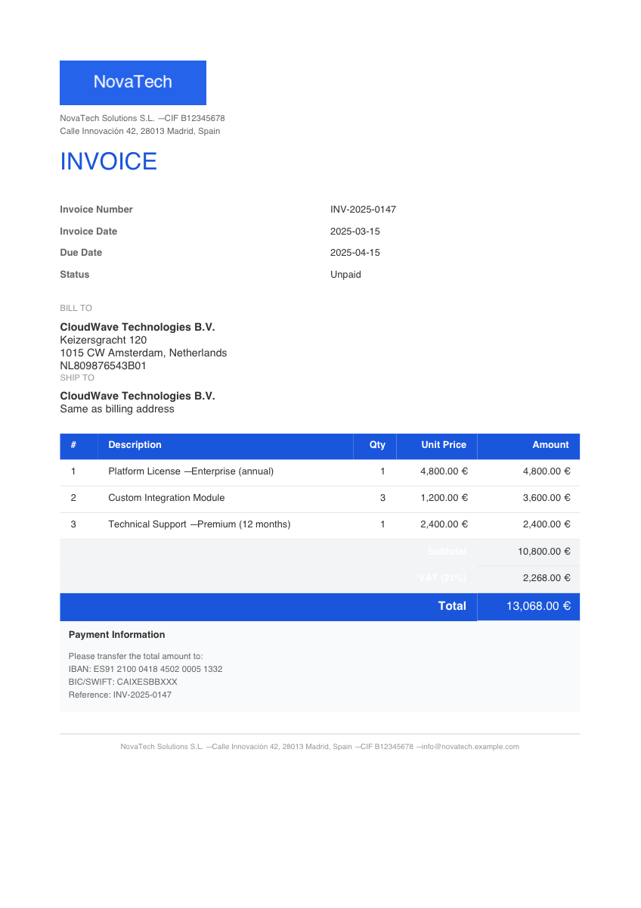
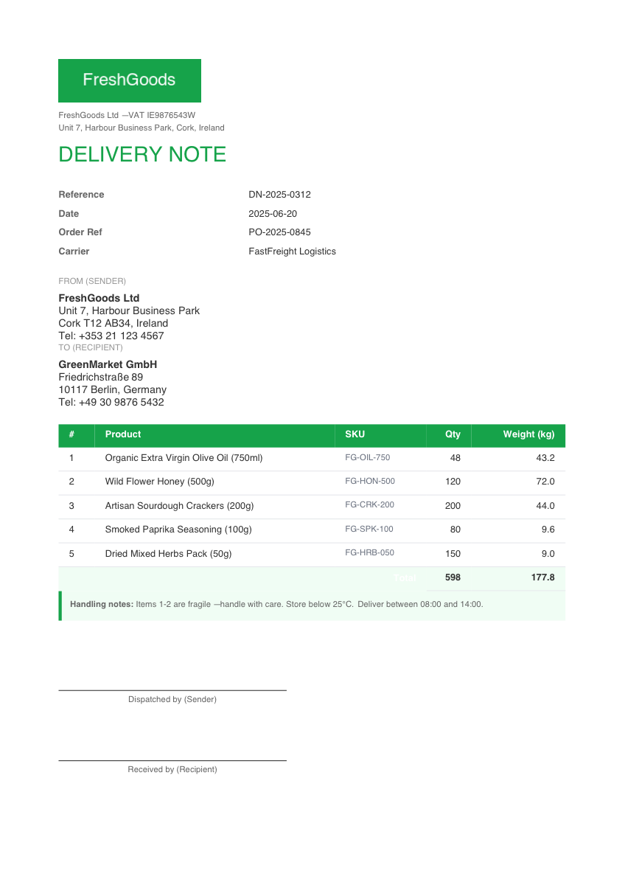
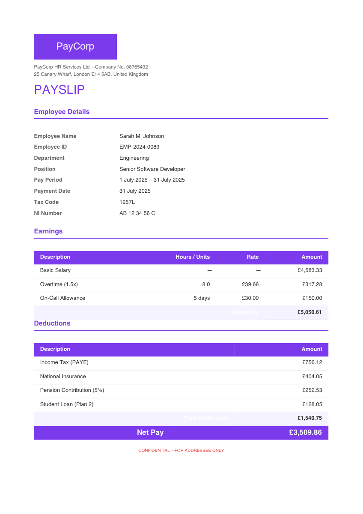

# Press

Press is a dependency-free Elixir library for rendering HTML+CSS into PDF,
targeting structured business documents: invoices, delivery notes, payslips,
and reports. "Dependency-free" means zero runtime dependencies — only modules
that ship with OTP itself (e.g. `:zlib`) are used.

## Usage

```elixir
html = """
<!DOCTYPE html>
<html>
<head>
  <style>
    body { font-family: Helvetica, sans-serif; font-size: 12pt; }
    h1 { color: #1a56db; }
  </style>
</head>
<body>
  <h1>Hello from Press!</h1>
  <p>Render HTML and CSS directly to PDF with zero dependencies.</p>
</body>
</html>
"""

{:ok, pdf_binary} = Press.render(html)
File.write!("document.pdf", pdf_binary)
```

Images (PNG and JPEG) can be referenced via data URIs or passed in an `:images` lookup map:

```elixir
logo_data = File.read!("logo.png")

{:ok, pdf_binary} = Press.render(html, images: %{"./assets/logo.png" => logo_data})
File.write!("invoice.pdf", pdf_binary)
```

## Examples

### Invoice

[examples/invoice.exs](examples/invoice.exs) renders a business invoice ([examples/invoice.html](examples/invoice.html)) with company branding, itemized table, tax breakdown, and payment details (`mix run examples/invoice.exs`):

```elixir
html = File.read!("examples/invoice.html")
logo = File.read!("examples/assets/novatech_logo.png")

{:ok, pdf} = Press.render(html, images: %{"./assets/novatech_logo.png" => logo})
File.write!("examples/invoice.pdf", pdf)
```



### Delivery Note (Albarán)

[examples/delivery_note.exs](examples/delivery_note.exs) renders a goods delivery note ([examples/delivery_note.html](examples/delivery_note.html)) with sender/recipient blocks, SKU table, weight summary, and signature areas (`mix run examples/delivery_note.exs`):

```elixir
html = File.read!("examples/delivery_note.html")
logo = File.read!("examples/assets/freshgoods_logo.png")

{:ok, pdf} = Press.render(html, images: %{"./assets/freshgoods_logo.png" => logo})
File.write!("examples/delivery_note.pdf", pdf)
```



### Payslip (Nómina)

[examples/payslip.exs](examples/payslip.exs) renders an employee payslip ([examples/payslip.html](examples/payslip.html)) with earnings, tax deductions, and net pay summary (`mix run examples/payslip.exs`):

```elixir
html = File.read!("examples/payslip.html")
logo = File.read!("examples/assets/paycorp_logo.png")

{:ok, pdf} = Press.render(html, images: %{"./assets/paycorp_logo.png" => logo})
File.write!("examples/payslip.pdf", pdf)
```



## Installation

The package can be installed by adding `press` to your list of dependencies in `mix.exs`:

```elixir
def deps do
  [
    {:press, "~> 0.1.0"}
  ]
end
```

Documentation can be generated with [ExDoc](https://github.com/elixir-lang/ex_doc)
and published on [HexDocs](https://hexdocs.pm). Once published, the docs can
be found at <https://hexdocs.pm/press>.

## License

Press is licensed under the [MIT License](LICENSE).
